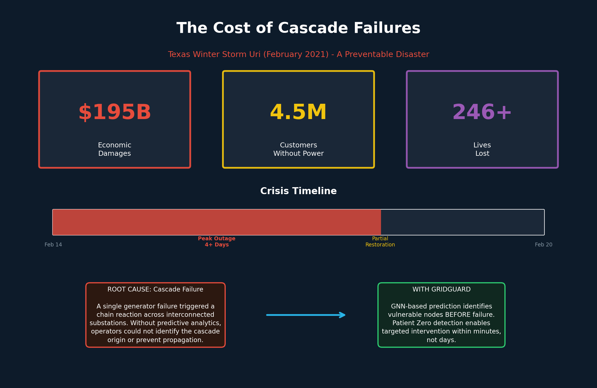
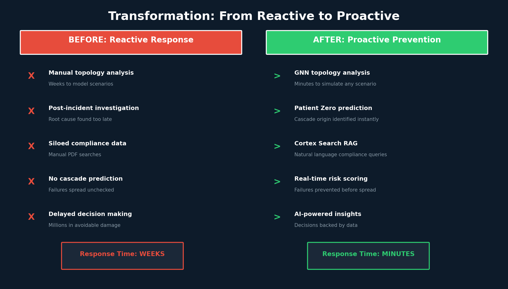
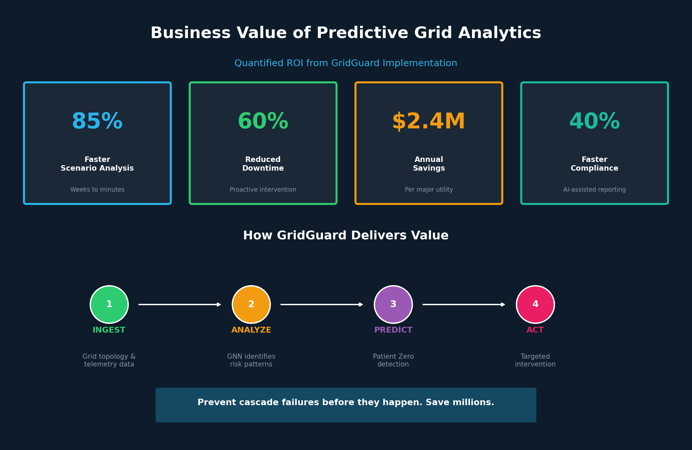
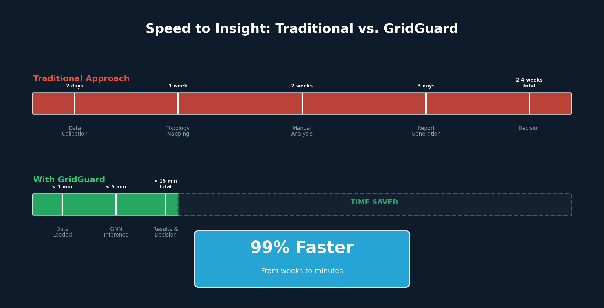
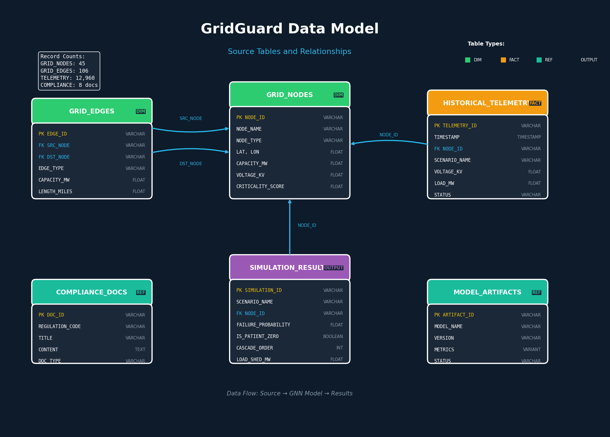
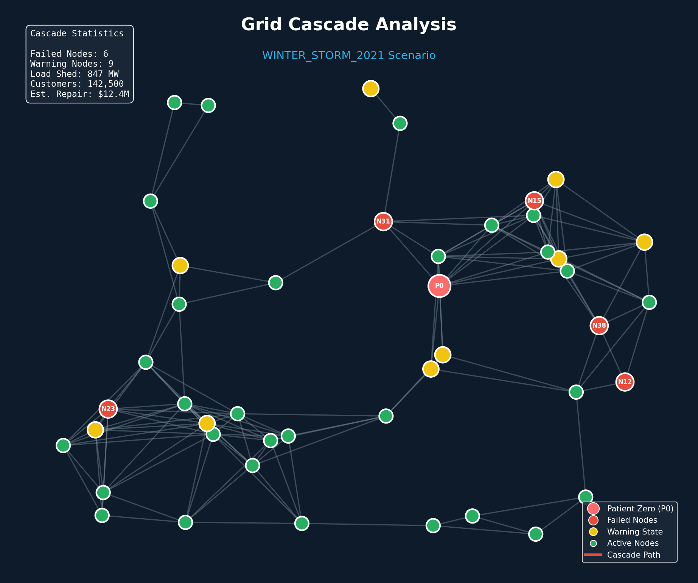
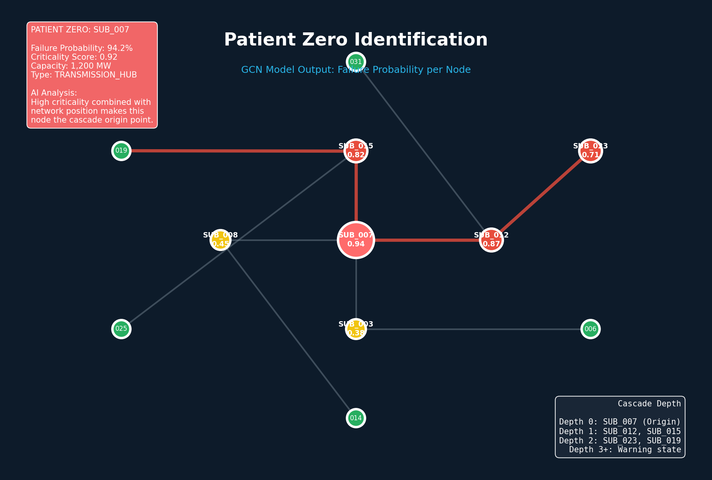
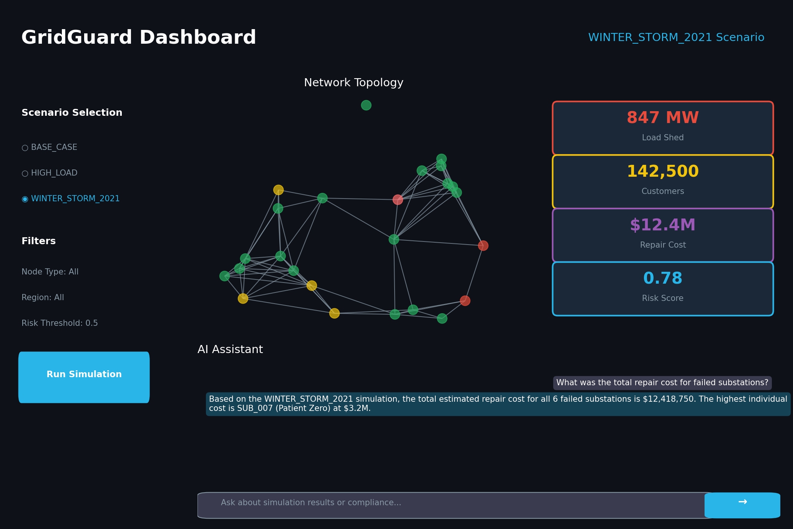
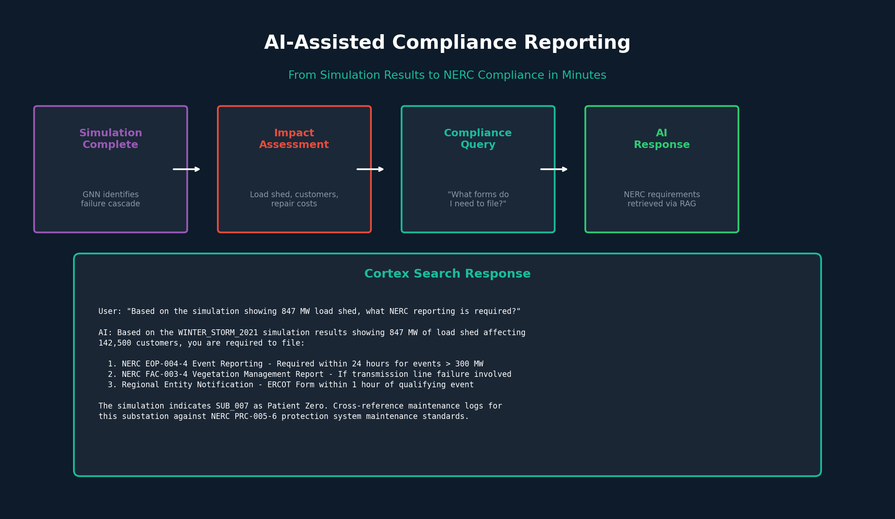

# GridGuard for Energy: Predict Cascade Failures Before They Happen with Snowflake

Energy grid operators lose millions when a single substation failure cascades across the network. Today, understanding why failures propagate takes weeks of manual analysis—if it happens at all.

---

## The Cost of Inaction



The Texas Winter Storm Uri (February 2021) demonstrated the catastrophic cost of cascade failures. A single generator failure triggered a chain reaction that left 4.5 million customers without power for days. The economic damage exceeded $195 billion. More than 246 lives were lost.

This was preventable. With predictive analytics, operators could have identified vulnerable nodes before the cascade began.

---

## The Problem in Context

- **Topology data is trapped.** Grid connectivity lives in legacy formats that resist modern analytics. Engineers cannot easily query which substations share load or how failures would propagate.

- **Scenario modeling takes weeks.** Simulating how infrastructure would handle a repeat of the 2021 Winter Storm requires manual data wrangling, custom scripts, and specialized expertise.

- **Post-incident analysis is reactive.** By the time teams identify the "Patient Zero" node that triggered a cascade, the damage is done. Protocols update slowly.

- **Compliance verification is manual.** Matching incident data against NERC regulations means searching PDFs and cross-referencing spreadsheets—error-prone and time-consuming.

---

## The Transformation



GridGuard transforms grid operations from reactive firefighting to proactive prevention. Manual processes that took weeks now complete in minutes. Post-incident investigation becomes pre-incident prediction.

---

## What We'll Achieve

- **Minutes, not weeks.** Model any disaster scenario in minutes by running Graph Neural Network inference on historical snapshots.

- **Automatic root cause identification.** The GCN model pinpoints "Patient Zero"—the cascade origin—with failure probabilities for every node.

- **Quantified financial impact.** Every simulation outputs load shed (MW), customers impacted, and estimated repair costs.

- **AI-assisted compliance.** Ask natural language questions about NERC requirements and get answers grounded in your actual incident data.

---

## Business Value



GridGuard delivers measurable ROI through faster analysis, reduced downtime, and streamlined compliance. Major utilities can expect annual savings of $2.4M or more through proactive failure prevention.

---

## Speed to Insight



Traditional scenario analysis requires weeks of data collection, topology mapping, manual analysis, and report generation. GridGuard compresses this entire workflow to under 15 minutes—a 99% reduction in time to decision.

---

## Why Snowflake

- **Unified data foundation.** Grid topology, historical telemetry, and compliance documents live in one governed platform. No more silos between operations and planning.

- **Performance that scales.** On-demand GPU compute via Snowpark Container Services runs PyTorch Geometric models without infrastructure management.

- **Collaboration without compromise.** Share simulation results across grid operators, regulators, and planning teams with fine-grained access controls.

- **Built-in AI/ML and apps.** Cortex Search indexes compliance docs for RAG. Cortex Analyst answers natural language queries over simulation results. Streamlit delivers insights to business users.

---

## The Data

GridGuard operates on four data domains that together enable cascade prediction and compliance verification.



### Source Tables

| Table | Type | Records | Purpose |
|-------|------|---------|---------|
| **GRID_NODES** | Dimension | 45 | Substations, generators, load centers with capacity, voltage, and criticality scores |
| **GRID_EDGES** | Dimension | 106 | Transmission lines connecting nodes with capacity and redundancy levels |
| **HISTORICAL_TELEMETRY** | Fact | 12,960 | Time-series sensor data across BASE_CASE, HIGH_LOAD, and WINTER_STORM_2021 scenarios |
| **COMPLIANCE_DOCS** | Reference | 8 | NERC regulation excerpts indexed for Cortex Search RAG |

### Output Tables

| Table | Purpose |
|-------|---------|
| **SIMULATION_RESULTS** | GNN model output: failure probabilities, Patient Zero, cascade order, financial impact |
| **MODEL_ARTIFACTS** | Trained model metadata, versioning, and training metrics |

### Data Characteristics

- **Freshness:** Batch historical analysis with on-demand simulation runs. The model trains on past incidents and infers risk for future scenarios.

- **Trust:** Role-based access control ensures only authorized users see critical infrastructure data. Full lineage from raw telemetry to simulation output.

- **Relationships:** GRID_NODES is the central entity. Edges connect nodes bidirectionally. Telemetry and simulation results link to nodes via foreign keys.

---

## Solution Architecture


The architecture shows how data flows through GridGuard:

- **Data Foundation:** Grid nodes, edges, telemetry, and compliance docs stored in Snowflake tables
- **SPCS GPU Compute:** PyTorch Geometric GCN model runs on-demand for training and inference
- **Analysis Results:** Simulation outputs include Patient Zero ID, cascade order, and financial impact
- **Cortex Intelligence:** Analyst handles structured queries; Search handles document retrieval
- **Streamlit Dashboard:** Business users explore results through interactive visualizations

---

## How It Comes Together

1. **Ingest grid topology and telemetry.** Load node, edge, and time-series data into governed Snowflake tables. → [Schema setup](../sql/02_schema_setup.sql)

2. **Index compliance documents.** Create a Cortex Search service over NERC regulation excerpts for natural language retrieval. → [Cortex setup](../sql/03_cortex_setup.sql)

3. **Train the cascade model.** A 3-layer Graph Convolutional Network learns failure patterns from historical incidents like WINTER_STORM_2021. → [Training notebook](../notebooks/grid_cascade_analysis.ipynb)

4. **Run batch inference.** Execute the trained model across all scenarios (BASE_CASE, HIGH_LOAD, WINTER_STORM_2021) to generate per-node failure probabilities. → Same notebook

5. **Explore results visually.** The Streamlit dashboard renders the grid topology with failed nodes highlighted, key metrics displayed, and Patient Zero identified. → [Dashboard](../streamlit/streamlit_app.py)

6. **Query with natural language.** Ask Cortex Analyst questions like "What was the total repair cost for failed substations?" and get SQL-backed answers.

7. **Take action with compliance guidance.** Use Cortex Search to find relevant NERC reporting requirements based on simulation results. → [Take Action page](../streamlit/pages/4_Take_Action.py)

---

## Key Visualizations

### Cascade Network Analysis



The network visualization shows grid topology with color-coded node states. Red nodes indicate failures, yellow shows warning states, and the Patient Zero node is prominently highlighted as the cascade origin.

### Patient Zero Identification



The GCN model identifies the most likely cascade origin by analyzing node features (capacity, voltage, load ratio) and network topology. The visualization shows propagation paths from the origin through connected nodes.

### Interactive Dashboard



The Streamlit application provides:
- Scenario selector for comparing BASE_CASE, HIGH_LOAD, and WINTER_STORM_2021
- Interactive network graph with failure highlighting
- Key metrics: Total Load Shed (MW), Customers Impacted, Repair Cost
- AI chat interface for natural language queries

---

## AI-Assisted Compliance



GridGuard integrates Cortex Search to provide AI-assisted compliance reporting. After a simulation completes, users can ask natural language questions about NERC reporting requirements. The system retrieves relevant regulations and maps them to specific simulation results—turning a multi-hour manual process into a conversational query.

---

## Call to Action

**Run the simulation in your Snowflake account.**

Deploy GridGuard and see cascade prediction in action with your own scenarios:

```bash
# Deploy infrastructure and applications
./deploy.sh

# Train model and generate results
./run.sh main

# Open the Streamlit dashboard
./run.sh streamlit
```

**Clone and customize for your grid.**

Fork the repository and adapt the solution for your infrastructure:
- Add your grid topology to `data/`
- Customize scenarios in telemetry data
- Extend the GCN model for your specific failure patterns

---

*GridGuard demonstrates how Snowflake's unified platform enables advanced AI/ML for critical infrastructure. Graph Neural Networks, GPU compute, and Cortex AI work together to transform reactive incident analysis into proactive resilience planning.*
